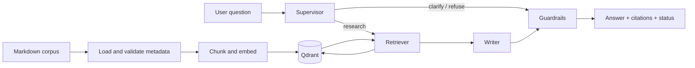

# Knowledge Assistant RAG

A grounded knowledge-base assistant built with FastAPI, LangGraph, Qdrant, and LangChain. It
indexes a Markdown corpus, retrieves relevant evidence, and returns answers with explicit source
citations.

The project uses a production-oriented architecture with explicit ingestion, retrieval,
orchestration, grounding, and evaluation layers. Its default offline mode is deterministic,
requires no API key, and exercises the complete RAG pipeline while keeping infrastructure
dependencies minimal.

## Highlights

| Capability | Implementation |
| --- | --- |
| Document ingestion | Markdown loader, YAML front matter, metadata validation, recursive chunking |
| Retrieval | Qdrant vector search, payload filters, lexical-aware candidate ordering |
| Orchestration | LangGraph supervisor, research, writer, and guardrails nodes |
| Grounding | Refusal on insufficient evidence and citations for successful answers |
| Interfaces | FastAPI HTTP API and Typer CLI |
| Evaluation | Offline dataset, status accuracy, citation accuracy, contract tests |
| Local operation | Docker Compose with deterministic embeddings and rule-based generation |

## Architecture



The source code is organised by responsibility:

```text
src/knowledge_agent/
├── agents/       # LangGraph workflow, state, prompts, model gateway, guardrails
├── api/          # FastAPI application and Pydantic schemas
├── cli/          # Typer commands
├── eval/         # Dataset, metrics, and evaluation runner
├── ingestion/    # Loading, metadata normalization, chunking, indexing
├── retrieval/    # Embeddings, Qdrant store, filters, ranking
├── config.py     # Environment-backed settings
└── runtime.py    # Dependency assembly and application runtime
```

## Quick start

Requirements: Docker with Compose support.

```bash
cp .env.example .env
docker compose up -d --build
docker compose exec app knowledge-agent ingest --recreate
```

Expected ingestion summary for the bundled corpus:

```json
{
  "documents": 22,
  "chunks": 70,
  "collection_size": 70
}
```

Check the service:

```bash
curl http://127.0.0.1:8000/healthz
curl http://127.0.0.1:8000/readyz
```

Ask an answerable question:

```bash
curl -X POST http://127.0.0.1:8000/chat \
  -H 'Content-Type: application/json' \
  -d '{
    "session_id": "readme-demo",
    "message": "How should API keys be stored?"
  }'
```

The response contract is deliberately small:

```json
{
  "answer": "A grounded answer followed by its sources.",
  "citations": ["faq-security-api-keys | API key security FAQ | API key security FAQ"],
  "status": "ok",
  "trace_id": "request-correlation-id"
}
```

Try a question outside the corpus to exercise the refusal path:

```bash
curl -X POST http://127.0.0.1:8000/chat \
  -H 'Content-Type: application/json' \
  -d '{
    "session_id": "refusal-demo",
    "message": "What is the weather in London today?"
  }'
```

## Response statuses

| Status | Meaning |
| --- | --- |
| `ok` | Relevant evidence was retrieved and citations were attached |
| `clarify` | The question is too broad or underspecified |
| `refuse` | The question is out of scope or the corpus has insufficient evidence |

## API

| Method | Path | Purpose |
| --- | --- | --- |
| `GET` | `/healthz` | Application liveness; does not call external services |
| `GET` | `/readyz` | Qdrant connectivity check |
| `POST` | `/chat` | Grounded answer with citations, status, and trace ID |

Interactive OpenAPI documentation is available at <http://127.0.0.1:8000/docs> while the API is
running.

## CLI

The same application runtime is exposed through the `knowledge-agent` command:

```bash
docker compose exec app knowledge-agent ingest --recreate
docker compose exec app knowledge-agent chat-demo \
  --question "How should API keys be stored?"
docker compose exec app knowledge-agent eval \
  --output-path /tmp/knowledge_agent_eval_report.json
```

## Local Python development

Use Python 3.11 or 3.12 in an isolated environment:

```bash
python3.12 -m venv .venv
.venv/bin/python -m pip install --upgrade pip
.venv/bin/python -m pip install -e '.[dev]'
cp .env.example .env
```

Start Qdrant and run the API from the virtual environment:

```bash
docker compose up -d qdrant
.venv/bin/knowledge-agent ingest --recreate
.venv/bin/uvicorn knowledge_agent.api.app:app \
  --host 127.0.0.1 \
  --port 8000 \
  --reload
```

## Quality checks

```bash
.venv/bin/ruff check src tests
.venv/bin/python -m pytest -q
docker compose config --quiet
```

The contract tests use in-memory Qdrant where possible and never call paid external APIs.

## Configuration

Copy `.env.example` to `.env`. These defaults run the complete local flow offline:

```env
LLM_MODEL=offline-rule-based
EMBEDDING_MODEL=hash://v1
LANGSMITH_TRACING=false
```

| Variable | Default | Purpose |
| --- | --- | --- |
| `QDRANT_URL` | `http://localhost:6333` | Vector database endpoint |
| `QDRANT_COLLECTION` | `knowledge_agent_docs` | Collection used for indexed chunks |
| `LLM_MODEL` | `offline-rule-based` | Generation backend or provider model name |
| `EMBEDDING_MODEL` | `hash://v1` | Deterministic local embeddings or provider model name |
| `TOP_K` | `4` | Number of chunks returned after ranking |
| `CHUNK_SIZE` | `500` | Target chunk size |
| `CHUNK_OVERLAP` | `80` | Overlap between adjacent chunks |
| `LANGSMITH_TRACING` | `false` | Optional LangSmith tracing switch |

### OpenAI-compatible providers

Live generation can use an OpenAI-compatible endpoint without changing application code:

```env
LLM_BASE_URL=https://provider.example/v1
LLM_API_KEY=your_key_here
LLM_MODEL=provider/model-name
```

Set an embedding model supported by the same provider if remote embeddings are required:

```env
EMBEDDING_MODEL=provider/embedding-model
```

Never commit `.env`, provider credentials, or private trace data.

## Design choices

- **Deterministic offline mode.** Hash embeddings and rule-based generation make tests and demos
  reproducible without network calls.
- **Direct retrieval in the graph.** The research node calls the retriever explicitly because the
  workflow is fixed; an autonomous tool-calling loop would add complexity without helping this
  use case.
- **Grounding before fluency.** Answers without supporting citations are converted to refusals.
- **Metadata-aware retrieval.** Topic and document-type filters are translated into Qdrant payload
  conditions before vector search.
- **One runtime for API and CLI.** Both interfaces use the same settings, store, retriever, model
  gateway, and compiled graph.

## Current limitations

- `hash://v1` is a compact deterministic backend, not a semantic production embedding model.
- `offline-rule-based` does not invoke a real LLM and is intended for reproducible local runs.
- The bundled corpus and evaluation dataset are intentionally small and synthetic.
- `/readyz` confirms Qdrant connectivity but does not guarantee that the collection is indexed.
- Live model calls and LangSmith tracing require private provider credentials.

Stop the services without deleting the persistent Qdrant volume:

```bash
docker compose down
```
